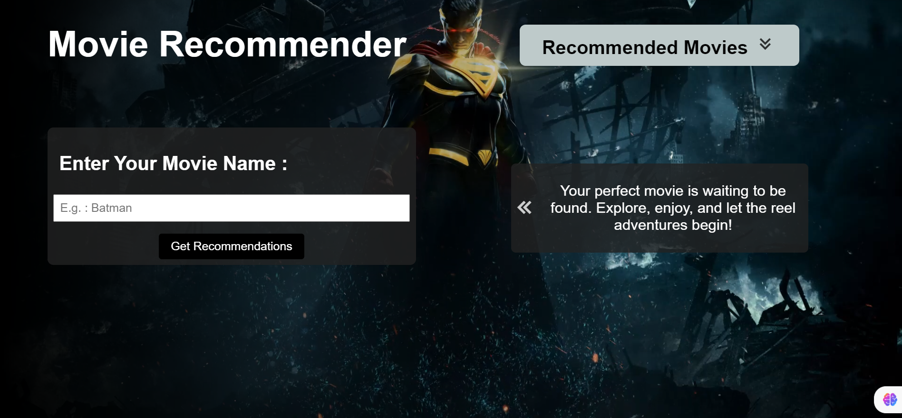

# MovieRecommendationSystem

Discover your next favorite movie with our Movie Recommender! This project combines Python algorithms for personalized suggestions with a sleek web interface built using HTML, CSS, and JavaScript

## Screenshots

*Movie Recommender application*

*Searching movies*

*Searching movies*

## Installation

- Open the Movie_rec_system.ipynb file and run the codes. Relavant packages have to be imported, such as pandas, numpy etc.
- After running the whole code, two pickle files would be downloaded. (movie_list.pkl, similarity.pkl)
- Copy those files and paste them inside the artifacts file in the project.
- Then run the app.py python file, and there you can get the URL of the site.

## Front-end

- JavaScript
- HTML
- CSS

## Back-end

- Python

